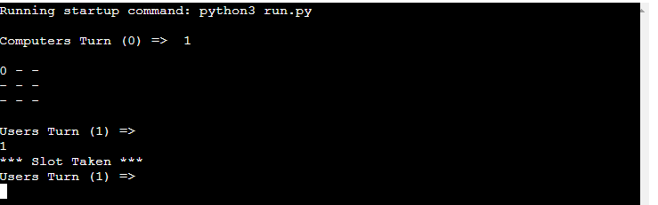

# Classic Tic Tac Toe
Classic Tic Tac Toe is an standard version of tic tac toe which originally required a pen and paper to play. More importantly it required another person to actually play against. 

In my version we no longer need another person or pen / paper since the game is hosted on Heroku with Code Institute's mock terminal. 

Play against the computer and have fun trying to outsmart it in order to win! [live version of the game](https://pythonproject3-tictactoe.herokuapp.com/)

# How to play
- In this version of tic tac toe the oponent (computer) will always start first
- For the purposes of this game the X is represented by the number 1 and the 0 is represented normally by 0
- The grid is made up of 9 positions and numbered from TOP LEFT to BOTTOM RIGHT as 1,2,3,4,5,6,7,8,9
- These positions are what you will use to tell the program which location you want to place the 1 at
- You can read more about tic tac toe rules [here](https://en.wikipedia.org/wiki/Tic-tac-toe)
- As per classic tic tac toe rules, whoever gets a line made of 3 uninterrupted characters (1s or 0s) WINS!

# Features

**Matrix**
- The game features a 9 position matrix on which the game is actually played
- This adheres to classic rules of tic tac toe and makes the game easily understandable

**Computer model**

- The computer oponent is fully reactive to your decisions as the user
- Computer will always try to reach 3 in a row the fastest way possible, however he will also not allow you to reach your goal either
- The computer will always start the game and have a pre-set position in order to maximize his chances of winning
- This position is not the same every game, it will vary

**Win Screens for both parties**
 - The game features winning screens made of ASCII text art for both win conditions (computer wins or user wins)

**Input validating and error checking**

- The program doesn't allow the user to input a value on the same space as an existing one or input some number isn't on the matrix location
- It will return the message "Slot Taken"

# Features left to implement

When I have more time I would like to implement the following:

-   A counter to check how many times the computer has won versus how many times the user has won
-   More Ascii art in order to make the game look better visually
-   A selectable mode where you can play against another human player, locally of course

# Testing
- I've manually tested the website in the most popular web browsers and I can confirm it works: Chrome, Mozilla, Safari, Brave

- I've also confirmed the project is responsive on all screen sizes, I did this using the developer tools in Chrome.

- I've tested the difficulty and played plenty of matches against the computer and he is not easily beaten

- I've tested the responsiveness of the computer model and it works up to my expectations

- I've run the code through PEP8 and confirmed there are no problems

- When given invalid inputs the program will not let you continue

**Validator Testing**

- I ran the python code through the PEP8 validator and no major errors were returned

- The only issue it showed was a "trailing whitespace" on ASCII text, however if i rectified that it would ruin the ASCII art so I decided to leave it

**Bugs**

- Initially there were a few bugs regarding my use of "==" instead of "is" for conditionals, however I just replaced "==" with "is" and the bugs no longer persist

# Deployment

The web app was deployed on Heroku and its using Code Institute's mock terminal in order to run

- Steps for deployment:
    - Fork / Clone the repository
    -  Create a new app in heroku
    -   Set the buildbacks to Python and NodeJS , make sure its in that order
    -   Link the heroku app to the repository in github
    -   Click on DEPLOY

# Credits

-   These youtube videos for providing information and snippets of code about this project: [Video 1](https://www.youtube.com/watch?v=BHh654_7Cmw)
[Video 2](https://www.youtube.com/watch?v=dK6gJw4-NCo)
[Video 3](https://www.youtube.com/watch?v=n2o8ckO-lfk)

