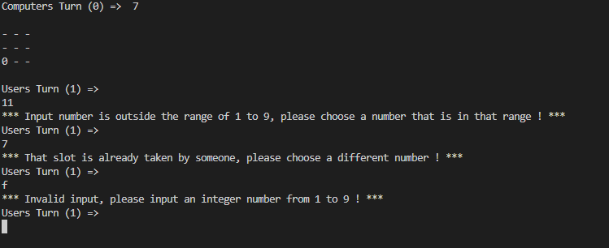

# Classic Tic Tac Toe
Classic Tic Tac Toe is an standard version of tic tac toe which originally required a pen and paper to play. More importantly it required another person to actually play against. 

In my version we no longer need another person or pen / paper since the game is hosted on Heroku with Code Institute's mock terminal. 

Play against the computer and have fun trying to outsmart it in order to win! [live version of the game](https://pythonproject3-tictactoe.herokuapp.com/)

# How to play
- In this version of tic tac toe the oponent (computer) will always start first
- For the purposes of this game the X is represented by the number 1 and the 0 is represented normally by 0
- The grid is made up of 9 positions and numbered from TOP LEFT to BOTTOM RIGHT as 1,2,3,4,5,6,7,8,9
- These positions are what you will use to tell the program which location you want to place the 1 at
- You can read more about tic tac toe rules [here](https://en.wikipedia.org/wiki/Tic-tac-toe)
- As per classic tic tac toe rules, whoever gets a line made of 3 uninterrupted characters (1s or 0s) WINS!

# Features

**Matrix**
- The game features a 9 position matrix on which the game is actually played
- This adheres to classic rules of tic tac toe and makes the game easily understandable

**Computer model**

- The computer oponent is fully reactive to your decisions as the user
- Computer will always try to reach 3 in a row the fastest way possible, however he will also not allow you to reach your goal either
- The computer will always start the game and have a pre-set position in order to maximize his chances of winning
- This position is not the same every game, it will vary

**Win Screens for both parties**
 - The game features winning screens made of ASCII text art for both win conditions (computer wins or user wins)

**Draw Screen**

- This happens when no one wins the game

**Input validating and error checking**

- The program doesn't allow the user to input a value on the same space as an existing one or input some number isn't on the matrix location
- I have made sure to include and handle every possible situation where the user could input the wrong thing:
    - If the user inputs a number that is outside of the games range (1-9) it will print out error message and detailed instructions

    - If the user inputs a slot that is already being used by either computer or player, the program will instruct user that the slot is already taken

    - If the user types a non integer value or a blank value the program will print out an error message and instructions about what to input

# Features left to implement

When I have more time I would like to implement the following:

-   A counter to check how many times the computer has won versus how many times the user has won
-   More Ascii art in order to make the game look better visually
-   A selectable mode where you can play against another human player, locally of course

# Testing
- I've manually tested the website in the most popular web browsers and I can confirm it works: Chrome, Mozilla, Safari, Brave

- I've also confirmed the project is responsive on all screen sizes, I did this using the developer tools in Chrome.

- I've tested the difficulty and played plenty of matches against the computer and he is not easily beaten

- I've tested the responsiveness of the computer model and it works up to my expectations

- I've run the code through PEP8 and confirmed there are no problems

- When given invalid inputs the program will not let you continue

## Defensive Application Testing
| Feature| Acceptance Criteria | Tests Carried out | Result |  
| --- | --- | --- | --- | 
| Inputting an integer| User can input an integer from 1 to 9 but nothing outside of that range | Inputted an integer outside of the 1 to 9 range, in this case the number 11| Pass |
| Inputting a non integer| User should not be able to input anything else than an integer | Inputted a non integer, in this case the letter F| Pass |
| Slot Checking| User should only be allowed to input a number corresponding to a slot that is not already occupied | Inputted a number corresponding to a slot occupied by the computer and then to a slot occupied by the player| Pass |
| Multiple errors| Program should be able to handle multiple errors in a row and still continue normally | Inputted multiple different wrong values about 10 times and then inputted a correct value| Pass |
| Computer Win| Program should print "You Lost" message when 3 "O's" are arranged in a row| Let the computer win by not getting in its way| Pass |
| Player Win| Program should print "you win" once you get 3 "1's" in a row | Played and beat the computer at tic tac toe| Pass |
| DRAW| Program should print "its a tie" when no side wins the game | Played and tried not to win or lose the game| Pass |

**Validator Testing**

- I ran the python code through the PEP8 validator and no major errors were returned

- The only issue it showed was a "trailing whitespace" on ASCII text, however if i rectified that it would ruin the ASCII art so I decided to leave it

# Libraries and Modules

- In order for the code to execute properly and achieve desired results I have used the following:

## Itertools - Combinations 

- Itertools implements a number of iterator building blocks, it standardizes a core set of fast, memory efficient tools. They form an iterator algebra making it possible to construct specialized tools succinctly and efficiently in Python.

- From itertools I chose to use the "combinations" module because it had all the attributes I needed for my code, it keeps the input in sorted order if its already sorted and there are no repeated elements.
- I used it specifically in the function that checks for every possible combination for both the computers side and the players side. This checks every possible combination of 3 positions on each row of the tic tac toe board due to the games rules. After that the function compares the computer or the players imput against the "winning list". 

# Deployment

The web app was deployed on Heroku and its using Code Institute's mock terminal in order to run

- Navigate to https://www.heroku.com

- Log in

- Click on Dashboard and then click on Create new app

- Choose a name for your app

- Choose a region that is closest to you

- Once the app is created click on the Settings tab

- Click on "config vars"

- Add Config Var Key = PORT and Value = 8000

- Click Add Buildback

- Add Python and then Nodejs, make sure you add them in that order

- Go to the deploy section and select your github profile for deployment

- Search and select for the desired repo name

- Click on Deploy Branch

- Done!

# Credits

-   These youtube videos for providing information and snippets of code about this project: [Video 1](https://www.youtube.com/watch?v=BHh654_7Cmw)
[Video 2](https://www.youtube.com/watch?v=dK6gJw4-NCo)
[Video 3](https://www.youtube.com/watch?v=n2o8ckO-lfk)

- I would also like to thank my mentor Victor who helped me fix and debug the issues with my app.
# Changelog

Latest changes made to the website:
- Input Validation
    - Added more extensive input validation and error checking
    - Fixed issue where inputting a non integer would crash the program
    - Added better feedback messages that tell the user what he did wrong ([example](https://i.imgur.com/EyTs1KP.png))
    - Fleshed out the "Input Validation" section in the readme.md
- Added "start screen" that includes information about the game and how to play it
- Added "Libraries and Modules" section in readme.md
- Added "Defensive Application Testing" section in readme.md
- Added draw outcome 
- Added better ascii text 

